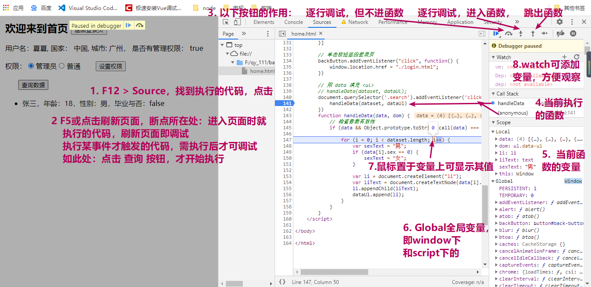

### 解惑与回顾

##### login.html

```js
// 操作document对象对页面上元素进行：增删改查
// line 60 处
var linkElement = document.createElement("a");
// var linkText = document.createTextNode("单击前往首页");
// linkElement.appendChild(linkText);
// 前两行也可以替换成以下：
linkElement.innerHTML = '单击前往首页' // 或者 linkElement.innerText = '单击前往首页'
// 所以思考一下：innerHTML和innerText的区别？ 显示这个看看'<div style="color">单击前往首页</div>'
```

##### home.html

```js
// 页面跳转的两种方式：a标签的href属性; set window.location.href的值
```

###### 解惑1：

```js
// 解惑1：(!! data[i].graduate)
/**
* 首选回顾一下js的数据类型：
* 基本类型：undefined、Null、string、Number、boolean
* 引用类型: Array、Object、Function
*/
// 此处涉及的知识点：类型转换 number 转成 boolean
// boolean为false的几个值：
// 转成boolean的方法：1.Boolean方法：Boolean('1122');  2. !(非符号) (! '1232')
// 关于!: not即表否定； !! 双重否定即为肯定 
// 例： 0转成Boolean是false
// !0是true  !true是false 所以 !!0 => !(!0) => !true => false  
// 0本身就是false 所以 !!0 与0 的boolean值相同

// 回顾一下：其他类型的转换， 如何转成string，number？
// 基本类型和引用类型的存储方式
```


[Boolean详细信息]: https://developer.mozilla.org/zh-CN/docs/Web/JavaScript/Reference/Global_Objects/Boolean

*注意：w3c 和 MDN 都可以查阅js的相关api，有些api可以了解一下，等到需要的时候具体查阅也可。*

###### 解惑2：

```js
if(data && Object.prototype.toString.call(data) === '[object Array]')
// Object.prototype.toString.call(data) === '[object Array]' 此处后面再说，这里超纲
// 重点说一下：&& 操作符
// && ： 为and之意，遇到false的数据，就不执行下去了，将false的数据返回，如无false就返回最后一个值， 回想为false的几个值（解惑1中也有提到）
    var a = 1 && 2 && (1 == '1');  var b = 1 && '' && 2; var c = 0 && (1 == '1') && 2
// 思考a、b、c的值分别是？ 可以使用console.log打印哟；
// 此处需注意操作符的执行顺序：先() => 再 && ;  c中先看 1 == '1'的执行结果
// ||: 为or之意， 与&&相反，遇到true的数据，中断执行；返回为true的值和最后一个值
    var d = 1 || 2 || (1 == '1');  var e = 1 || '' || 2; var f = 0 || (1 == '1') || 2
 // d、e、f的值是？
  
```

```js
// ++ 运算符: 自增（相当于+1）
// i++ 与 ++i
// 我的理解： var i = 1; var a = i++; => 先将i的值赋给a; i再加1; 此句执行完 a = 1; i = 2
// var i = 1; var b = ++i; i先+1；再附值给b 此句执行完：i=2; b = 2
```

[操作运算符的执行顺序]: https://developer.mozilla.org/zh-CN/docs/Web/JavaScript/Reference/Operators/Operator_Precedence

##### 此章节：重点调试与回顾

功能点：(img/o306/1.png)

1. 数据若中没有country字段，默认显示中国
2. role：0 是否有管理权限显示false，权限：普通是选中状态；查询数据 按钮不显示；
3. 选中管理员，点击设置权限，role: 1, 是否有管理权限显示true，查询数据按钮显示
4. 选中 普通，role:0 同2
5. 点击 查询数据按钮时，数据列表显示，按钮隐藏时，清空列表数据

页面数据：

```js
 var userInfo = {
            name: '夏夏',
            city: '广州',
            role: 0
        }
 // 注意点，也可通过 document.getElementsByName 获取元素，打印出来看下获取的是什么类型的数据， 
 // 可以通过checked属性判断radio的选中状态； xxx.checked是读取； xxx.checked = true 是设置
 // 通过value属性获取radio的值
```


调试：(img/o306/2.png)

